Gallery
********

In this page, we demonstrate the output of various oversampling                     and noise removal techniques, using default parameters.

For binary oversampling and nosie removal, an artificial database was used, available in the ``utils` directory of the github repository.

For multiclass oversampling we have used the 'wine' dataset from                     ``sklearn.datasets``, which has 3 classes and many features, out                     which the first two coordinates have been used for visualization.

Oversampling sample results
============================

In the captions of the images some abbreviations                     referring to the operating principles are placed. Namely:

    * NR: noise removal is involved
    * DR: dimension reduction is applied
    * Clas: some supervised classifier is used
    * SCmp: sampling is carried out componentwise (attributewise)
    * SCpy: sampling is carried out by copying instances
    * SO: ordinary sampling (just like in SMOTE)
    * M: memetic optimization is used
    * DE: density estimation is used
    * DB: density based - the sampling is based on a density of importance assigned to the instances
    * Ex: the sampling is extensive - samples are added successively, not optimizing the holistic distribution of a given number of samples
    * CM: changes majority - even majority samples can change
    * Clus: uses some clustering technique
    * BL: identifies and samples the neighborhoods of borderline samples
    * A: developed for a specific application

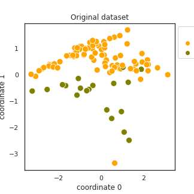

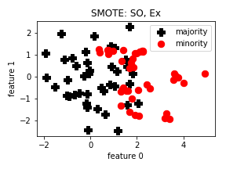
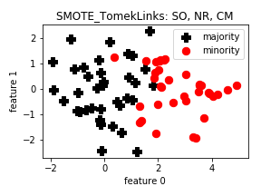
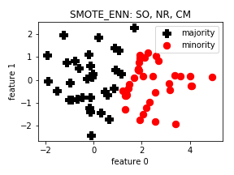
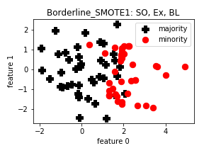

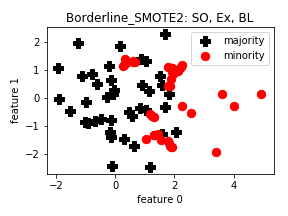
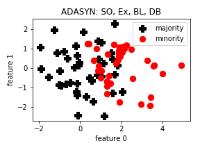
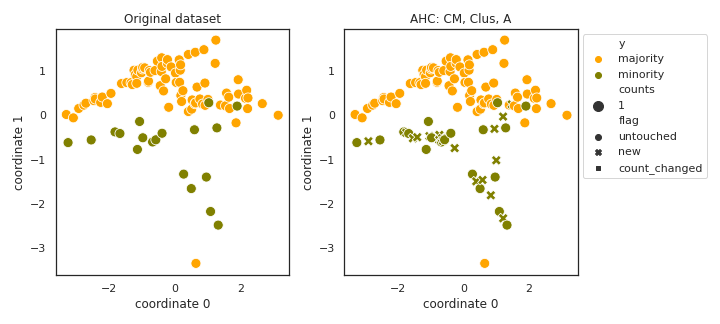
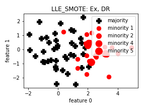

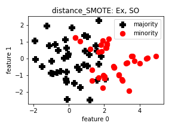
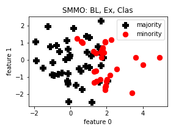
.. image:: figures/polynom_fit_SMOTE.png
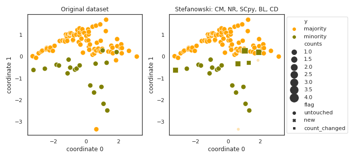

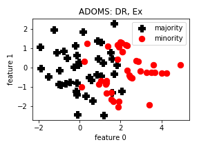
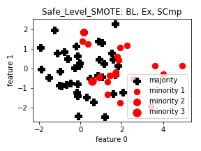
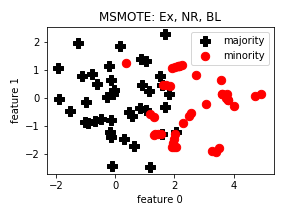
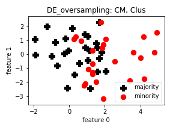

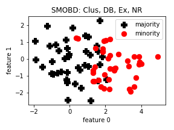
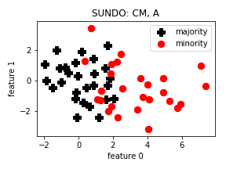
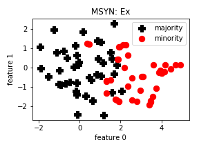
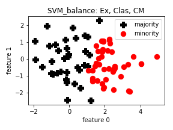

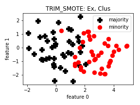
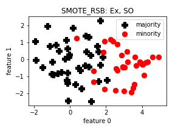
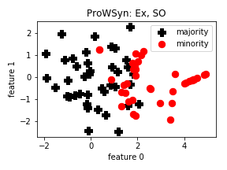
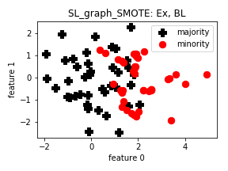

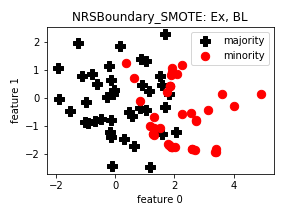
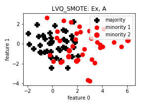
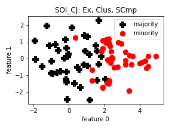
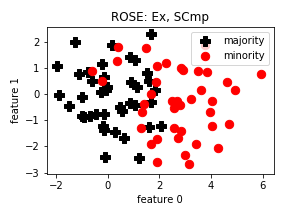

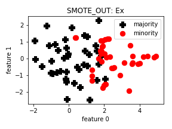
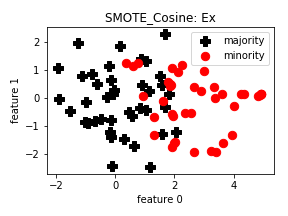
.. image:: figures/Selected_SMOTE.png
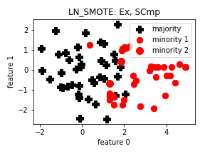

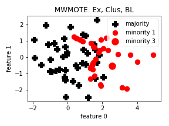
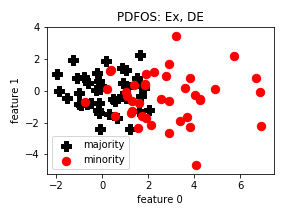
.. image:: figures/IPADE_ID.png
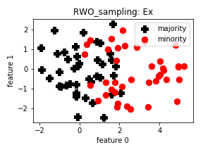

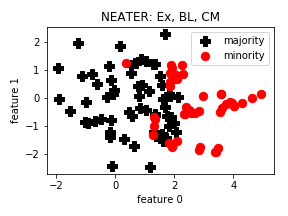
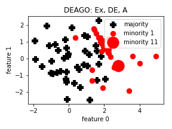
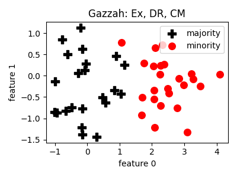
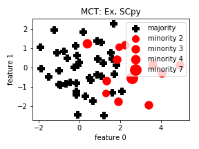

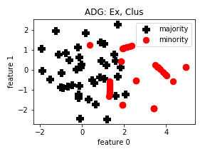
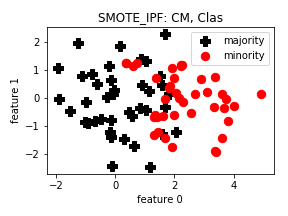
.. image:: figures/KernelADASYN.png
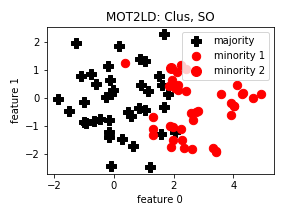

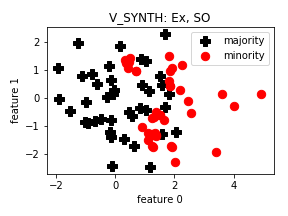
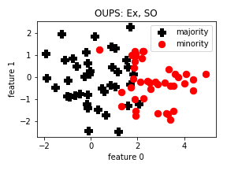
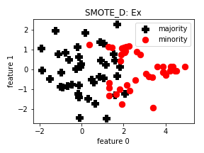
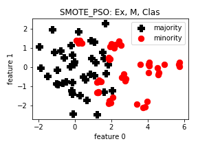

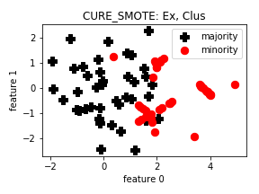
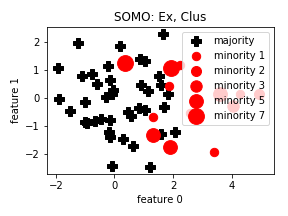
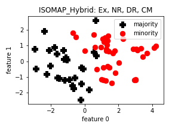
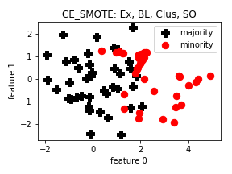

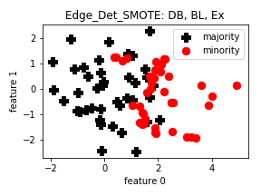

.. image:: figures/NT_SMOTE.png

Noise removal sample results
=============================

Multiclass sample results
==========================

.. figure:: figures/multiclass-base.png

.. image:: figures/multiclass-Borderline_SMOTE2.png

.. image:: figures/multiclass-polynom_fit_SMOTE.png

.. image:: figures/multiclass-SMOTE_D.png

.. image:: figures/multiclass-CE_SMOTE.png

.. image:: figures/multiclass-Assembled_SMOTE.png

.. image:: figures/multiclass-ANS.png

